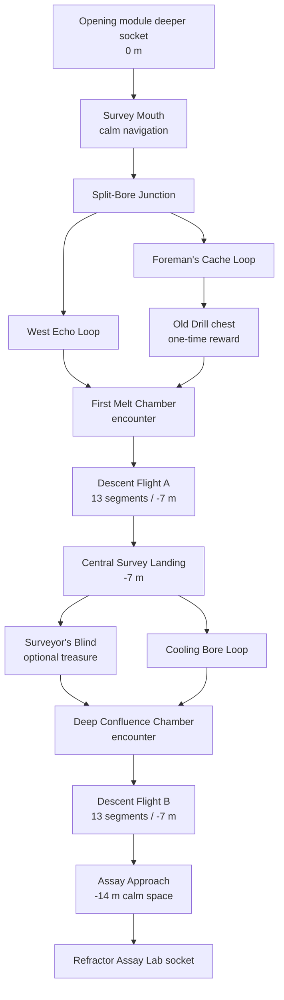

# Linear Digger Excavation — Blueprint Proposal

Status: proposal only. This document does not authorize runtime implementation or re-enable the retired Magma dungeon family.

## Module contract

- Stable module ID: `magma-linear-digger-excavation`
- Proposed topology revision: `1`
- Function: recently bored excavation network between the Breached Freight Adit and the Refractor Assay Lab
- Footprint: `43 × 35` macro tiles (`120.4 × 98 m`)
- Clear tunnel width: `3 tiles / 8.4 m` minimum everywhere
- Tunnel headroom: `8.4 m` minimum; chambers use `11.2 m`
- Entrance elevation: `0 m` relative to the opening module’s deeper socket
- Exit elevation: `-14 m`
- Total internal descent: exactly `14 m`
- Required descent assembly: two separated, three-wide, 13-segment flights; each flight descends `7 m`
- Ramp rise per segment: approximately `0.538462 m`
- Every ramp endpoint and turn: prop-free `3 × 3` flat landing
- Player sockets: south entry at `0 m`; north Assay Lab approach at `-14 m`; each `8.4 × 5.6 m`
- Environmental sockets: continuous `4.2 m` lava inlet and outlet, preserving `magma-refinery-lava-spine`

## Spatial identity

The module is directionally linear but locally maze-like. The player always progresses deeper through three elevation bands, while each band contains two readable route choices, one short return loop, and one or more chambers. It is not a random corridor carver.

The authored grammar selects one validated arrangement per seed:

1. Upper excavation loop orientation: west-first or east-first.
2. One of two safe bridge positions across the lava spine.
3. Two of three optional chamber sockets active, with unused sockets receiving authored basalt-and-brace caps.
4. Encounter dressing and rubble variation outside every travel, landing, camera, and reward clearance.

The critical descent, Old Drill branch, lava continuity, room elevations, socket locations, and return loops remain stable across variants.

## Route graph

## Chambers

### Survey Mouth

- Calm `9 × 7`-tile staging chamber.
- Recent Digger lamps, cable reels, survey paint, drill spoil, and temporary braces.
- Exposes the lava river and both first maze routes without allowing an unintended shortcut.
- Entry socket has a clear `3 × 3` landing and camera-clear volume.

### Split-Bore Junction

- `9 × 9`-tile navigation chamber organized around a failed drill turntable.
- Three exits are visible from the center; two reconnect before Flight A.
- The machinery is collision-backed and sits outside all three-wide routes.

### Drill Foreman’s Cache

- Optional `7 × 7`-tile chamber on the upper east loop.
- Contains the one-time Old Drill chest on a safe, flat reward anchor.
- The chest is not encounter-locked and is immediately collectible once reached.
- A sightline through a cracked bore wall previews the lower lava cascade.

### First Melt Chamber

- `11 × 9`-tile encounter chamber where a recent bore broke into the ancient lava channel.
- Safe perimeter route remains usable; the ordinary encounter does not lock Flight A or a required control.
- Two optional combat flanks approach the lava but never require magma traversal.

### Central Survey Landing

- Calm `9 × 7`-tile landing at `-7 m` between the two descent flights.
- Contains the required switchback turn, both `3 × 3` landing buffers, and a clear view back toward the entrance tier.
- Both descent flights enter and exit through open flat continuations: every ramp lane receives at least two additional forward floor bays at both ends before any chamber turn, with no wall, prop, or collision plane facing across a ramp approach.
- No chest, control, encounter spawn, prop, or trap occupies the landing reservation.

### Surveyor’s Blind

- Optional `7 × 4`-tile treasure chamber behind a legible side bore.
- Contains ordinary salvage and lore, not the Old Drill.
- Reconnects to the middle route rather than becoming a long dead end.

### Deep Confluence Chamber

- `11 × 10`-tile encounter chamber where two bored galleries meet the widening lava river.
- Includes a safe three-wide outer route, supported lookout deck, and optional lava-adjacent combat flank.
- Flight B remains readable from the chamber entrance.

### Assay Approach

- Calm `9 × 7`-tile exit chamber at `-14 m`.
- Ancient refinery frames begin to outnumber modern braces, transitioning visually into the Assay Lab.
- Exit and lava-continuity sockets each retain clear, separately validated thresholds.

## Lava spine

- The lava river enters beside the player socket, remains visible or audible throughout the maze, and exits beside the Assay Lab socket.
- Normal channel width is `4.2 m`; First Melt and Deep Confluence may widen it to `8.4 m` without consuming the safe route.
- Two modeled cascades accompany the two `7 m` descent flights.
- Required progression never crosses deep magma and never requires a jump.
- Optional bridges, lookout ledges, secrets, and combat flanks may approach or cross the channel only within the validated player traversal envelope.
- Every channel surface has hazard collision, `24 DPS`, burn application, movement penalty, severe enemy path cost, and heat-compatible spawn filtering.
- Every visible lower bank is registered playable space, lava, or collision-backed basalt—not exterior void.

## Old Drill reward

- Item ID: `oldDrill`
- Display name: `Old Drill`
- Type: unique crafting component
- Stable chest ID: `magma-linear-excavation-old-drill-chest`
- Persistence key: `oldDrillClaimed`
- Claim behavior: award once per save, persist immediately, and leave the physical chest visibly open on revisits.
- Recipe role: required unique component for the future utility arm `drillArm`; remaining recipe materials are intentionally unspecified in this proposal.
- Future Drill Arm behavior: destroys only authored obstacles carrying a `ruinDrillObstacle` capability tag. Structural walls, sockets, progression gates, and arbitrary scenery remain indestructible.

## Camera occlusion

Reuse the Industrial Factory’s existing camera-to-player segment occlusion system.

- Partition walls, low ceilings, braces, and large drill housings into local owner groups no longer than three macro bays.
- Mark each local group with `cameraOcclusionOwner: true` and its blocking meshes with `cameraOcclusionSurface: true`.
- Never group an entire maze band under one owner; hiding one wall must not erase unrelated geometry across the room.
- Doorway wings, chamber corners, slope ceilings, and bridge frames own independent occlusion groups.
- Reserve camera-clear volumes at junction centers, all `3 × 3` landings, reward anchors, and chamber thresholds.
- Validate the three-ray player-silhouette test from both travel directions and every elevation band.
- Restore each owner immediately when the camera-to-player segment clears.

## Structure, collision, and materials

- Recently bored earth uses hexagonal basalt fracture masses mixed with irregular excavated shells; ancient refinery frames appear increasingly toward the exit.
- Every wall, floor, ceiling, slope, bridge, railing, brace, support, socket frame, prop, and hazard has matching collision.
- Separate elevation bands never register two safe walkable floors in the same X/Z column; a generated overlap rejects the room plan.
- Wall collision expands by the player capsule radius, and instanced wall, ceiling, and ramp panels occlude individually when they cross the camera-to-player segment.
- Elevated routes have supports extending to their queried owning floor.
- All paths and chambers are fully enclosed and use tiled Magma Refinery textures at the established world-meter scale.
- No texture stretches across a tunnel run, chamber wall, slope, or support.
- No stacked rubble, cable, brace, chest, encounter spawn, or machinery collider enters an `8.4 m` travel lane or landing reservation.

## Acceptance requirements

- Critical path reaches the Assay Lab without entering magma, completing an ordinary encounter, or using a precision jump.
- Both maze loops reconnect and remain at least three tiles wide throughout.
- Both descent flights are three tiles wide, 13 segments long, supported, enclosed, and terminate in `3 × 3` flat landings.
- Exact elevation changes are `0 → -7 → -14 m` with no conflicting support layer.
- Old Drill chest is reachable, immediately collectible, unique, persistent, and not encounter-locked.
- Every chamber has a distinct purpose, collision, camera fixture, minimap footprint, and safe anchor.
- The lava inlet and outlet align with neighboring environmental sockets within `0.05 m`.
- Camera occlusion hides only the blocking local owner and restores it immediately.
- Public keyboard/mouse tests traverse both upper-loop orders, both middle-loop orders, both descent flights, the Old Drill branch, and the exit without teleporting or mutating private state.
